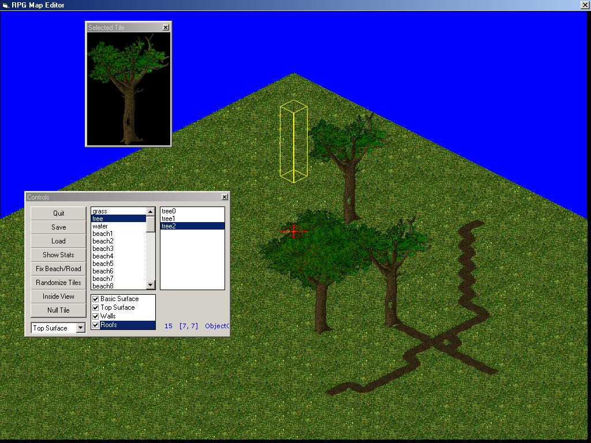



## Isometric Game Graphics Engine \[Fully Documented, uses DirectX\]

### Description

This is a Class Module that contains an entire Isometric Graphics Engine (1300+ lines of code) powered by DirectDraw (DirectX). It's written abstract, by the rules, yet very readable and understandable. Source code is fully documented (took me nearly 2 hours to document) plus three page manual.
 
### More Info
 
Basic API knowledge.

Basic DirectX knowledge would help, but not necessary.

             |
---                |---
**Submitted On**   |2002-08-27 10:30:38
**By**             |[Wouter Lievens](https://github.com/Planet-Source-Code/PSCIndex/blob/master/ByAuthor/wouter-lievens.md)
**Level**          |Intermediate
**User Rating**    |4.9 (103 globes from 21 users)
**Compatibility**  |VB 6\.0
**Category**       |[Games](https://github.com/Planet-Source-Code/PSCIndex/blob/master/ByCategory/games__1-38.md)
**World**          |[Visual Basic](https://github.com/Planet-Source-Code/PSCIndex/blob/master/ByWorld/visual-basic.md)
**Archive File**   |[Fully\_Docu1230018272002\.zip](https://github.com/Planet-Source-Code/wouter-lievens-isometric-game-graphics-engine-fully-documented-uses-directx__1-38365/archive/master.zip)

